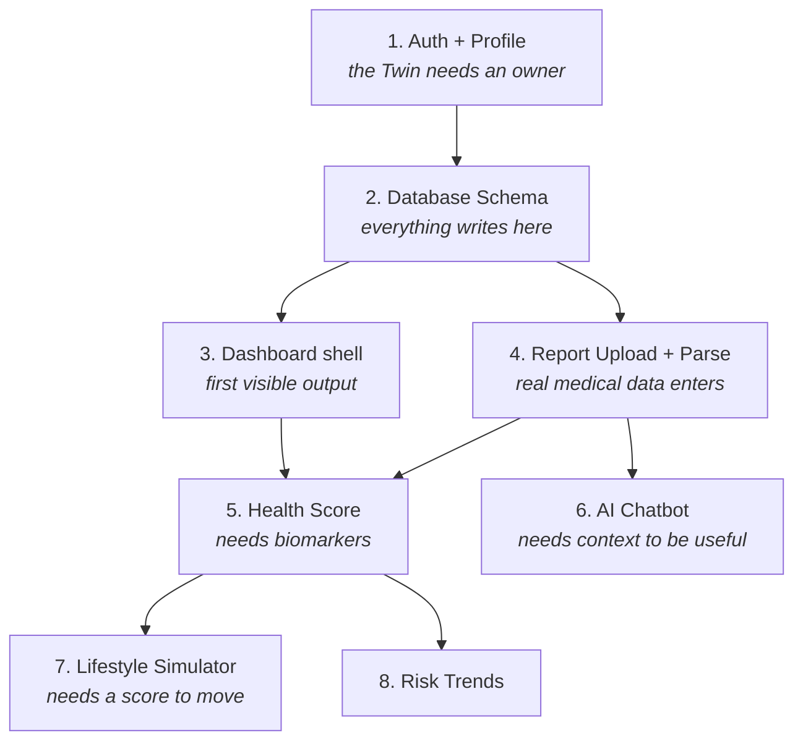

# AURA — Product Roadmap

**Current stage:** Design complete, implementation not started.
**Target:** Working end-to-end MVP demo at TetraTHON 2026 (36-hour build).

---

## How to Read This Document

This roadmap is written to be executed, not admired. It answers three questions in order:

1. **What are we deliberately *not* building?** — scope control comes first, because a 36-hour build fails from over-ambition far more often than from weak ideas.
2. **What decisions are already locked?** — every open question during a hackathon costs 30+ minutes of arguing. They are resolved below, with reasoning.
3. **What exactly gets built, in what order, and how do we know it works?** — each feature has a technical spec and a testable definition of done.

Sections marked **⚠️ Decision** are choices that were made with trade-offs. If you disagree, change them *before* the build starts — not at hour 14.

---

## Guiding Principles

These four rules resolve most arguments during the build.

**1. The Digital Twin is the product. Everything else is an interface to it.**
Every feature must either *write data into* the Twin or *read insight out of* it. If a feature does neither, it does not belong in the MVP. This is the single rule that separates AURA from a chatbot with a health theme.

**2. Demo-visible beats architecturally pure.**
A judge sees the screen, not the code. When a choice is between a clean abstraction and something demonstrable two hours sooner, take the demonstrable one — and write down the debt.

**3. Every AI output must trace back to user data.**
If AURA says "your cholesterol trend is concerning," it must be able to show *which* report, *which* value, and *which* date produced that claim. Untraceable AI output in a health product is worse than no output.

**4. Safety is a feature, not a disclaimer.**
Guardrails are built into the system prompt and the response path — see [AI Safety Guardrails](#ai-safety-guardrails). The legal disclaimer in the README does not substitute for this.

---

## Non-Goals for the MVP

Explicitly out of scope. Listing these is what makes the timeline achievable.

| Not building | Why not |
|---|---|
| **Real medical accuracy claims** | AURA explains and flags. It does not diagnose. Diagnosis requires clinical validation we cannot do in 36 hours, and claiming it is both unsafe and dishonest. |
| **Six separately deployed AI agents** | See the ⚠️ Decision on agent architecture below. The multi-agent design is real, but the MVP implements it as routed roles, not as six services. |
| **Flutter mobile app** | One frontend only. See the ⚠️ Decision on frontend. |
| **HIPAA / GDPR compliance** | Requires legal review, audit logging, and a BAA with every vendor. We build *toward* it (encryption, de-identification) but do not claim it. |
| **Wearable integration** | Every provider needs OAuth approval that takes days to weeks. Impossible inside the event window. |
| **Model training from scratch** | We use pre-trained LLMs and simple statistical models. Training anything meaningful needs data we do not have. |
| **Multi-user / family accounts** | Doubles the data model complexity for zero demo value. |

---

## Locked Technical Decisions

### ⚠️ Decision 1 — Use Gemini as the primary model, and let it do the OCR

**Chosen:** Gemini API as the reasoning model *and* the report reader. Tesseract stays as an offline fallback only.

**Reasoning:** The deck lists OCR (Google Vision / Tesseract) and the LLM as separate stages. That pipeline is: image → OCR → raw text → LLM → explanation. Every stage adds failure modes, and OCR on a blood report is the worst of them — lab reports are dense tables, and generic OCR returns a scrambled wall of text with the column structure destroyed. The LLM then has to guess which number belongs to which test.

A multimodal model reads the report image directly and returns structured JSON in one call. Fewer moving parts, better table handling, and roughly half the build time for the hardest feature in the MVP.

**Cost of this choice:** Vendor lock-in on the parsing path, and no parsing when the API is down. Mitigation: the extraction step sits behind one interface (`ReportParser`) so a Vision API or Tesseract implementation can be swapped in without touching anything else.

**Fallback trigger:** If structured extraction accuracy is below roughly 80% on our test reports by hour 12, switch to Vision API for extraction and keep Gemini only for explanation.

---

### ⚠️ Decision 2 — React web dashboard only. No Flutter in the MVP.

**Chosen:** React.js web app. Flutter is deferred to Phase 2.

**Reasoning:** Building both means writing every feature twice and debugging two auth integrations and two upload flows. Between the two, web wins for this event: it demos on a projector without screen mirroring, judges can open the deployed URL on their own laptops, and deployment is a push instead of a build pipeline.

**Cost of this choice:** "Mobile app" is a stronger pitch for a personal health companion, and we lose it. Mitigation: build the web dashboard mobile-responsive and demo it in a phone-sized viewport. It reads as a mobile product without being one.

---

### ⚠️ Decision 3 — One reasoning core with routed roles, not six deployed agents

**Chosen:** A single orchestration layer that routes each query to a role-specific prompt and tool set. The Doctor, Nutrition, Fitness, Medication, and Prediction roles are real and distinct — they are prompts with different tools and different slices of Twin context, not separate services.

**Reasoning:** Six independently deployed agents means six sets of prompts, error handling, and inter-agent messaging. Inter-agent communication is also where multi-agent systems fail most often — agents contradict each other and no layer resolves it. The Digital Twin Core in our architecture *is* that resolving layer, so it should be built first and hold the authority.

**Cost of this choice:** Less impressive if a judge asks to see the agent infrastructure. Mitigation: the routing decision is logged and surfaced in the UI — when the Nutrition role handles a query, the interface says so. The specialization is visible even though the deployment is unified.

**This is not a downgrade of the vision.** The architecture in the README stays accurate. Phase 2 splits the roles into independent services once there is reason to scale them separately.

---

### ⚠️ Decision 4 — The Health Score must be transparent, not clever

**Chosen:** A weighted, fully explainable score. No ML model behind it in the MVP.

```
Health Score = 100 - (risk deductions)

  Lab markers out of reference range   up to -30
  Sleep (vs 7-9 hour target)           up to -20
  Activity (vs 8,000 step target)      up to -20
  BMI outside healthy range            up to -15
  Hydration (vs 2.5L target)           up to -10
  Unresolved medication conflicts      up to -5
```

**Reasoning:** An ML-predicted score cannot answer "why is my score 68?" — and that is the first question every judge and every user asks. A transparent formula turns the score into a feature: tapping it reveals exactly which factors cost how many points, which then feeds the Lifestyle Simulator directly (change an input, watch the deduction shrink).

**Cost of this choice:** It is arithmetic, not machine learning, and the deck promises XGBoost. Mitigation: XGBoost is used for the *risk trend forecast*, which is a genuine prediction problem, rather than for the score. Be honest about this if asked — a defensible simple model reads as better engineering judgment than an unexplainable complex one.

---

### ⚠️ Decision 5 — Never send identity to the LLM

**Chosen:** All data leaving our backend is de-identified. Name, email, phone, and exact date of birth are stripped and replaced with derived values (age, sex, band).

```
Stored in our DB:      "Shubham Kumawat, DOB 1998-04-12, HbA1c 6.4"
Sent to the model:     "28y male, HbA1c 6.4 (ref 4.0-5.6)"
```

**Reasoning:** The moment a name and a diagnosis travel together to a third party, this becomes a privacy problem regardless of what the vendor's retention policy says. Stripping identity costs one mapping function and removes the entire category of risk. The model does not need a name to reason about a lab value.

**Cost of this choice:** Slightly less personal phrasing in responses. Mitigation: the frontend re-inserts the user's name into the rendered reply.

---

## Data Model

Everything in Phase 1 is built on these six tables. Agreeing on this before writing feature code is what prevents the mid-build schema rewrite.

| Table | Holds | Key fields |
|---|---|---|
| `users` | Identity and auth link | `id`, `firebase_uid`, `email`, `created_at` |
| `profiles` | The static baseline of the Twin | `user_id`, `dob`, `sex`, `height_cm`, `weight_kg`, `conditions[]`, `allergies[]`, `goals[]` |
| `reports` | Uploaded documents and extraction results | `id`, `user_id`, `file_url`, `report_type`, `extracted_json`, `parsed_at`, `parse_status` |
| `biomarkers` | One row per lab value — the queryable layer | `report_id`, `name`, `value`, `unit`, `ref_low`, `ref_high`, `flag`, `measured_at` |
| `daily_logs` | Time-series lifestyle data | `user_id`, `date`, `steps`, `sleep_hours`, `water_ml`, `calories_in`, `calories_out` |
| `medications` | Active prescriptions | `user_id`, `drug_name`, `dose`, `schedule`, `start_date`, `end_date` |

**The critical design note:** `biomarkers` is separate from `reports` on purpose. Reports are documents; biomarkers are data points. Splitting them is what makes "show me my HbA1c over the last three reports" a simple query instead of a JSON-parsing exercise. Every trend, chart, and risk calculation in the product depends on this separation existing from day one — retrofitting it later means reprocessing every stored report.

---

## Phase 1 — Hackathon MVP

### Build Order and Dependencies

Features are ordered by dependency, not by importance. Building out of this order causes rework.



The two rules encoded in this graph:

- **The chatbot comes after the report parser.** A chatbot with no health data is a generic AI assistant, which is exactly what AURA claims not to be. Building it first produces a demo that undermines the pitch.
- **The dashboard shell comes early even though it is nearly empty.** It provides a place to render every subsequent feature, and it means there is something showable from hour 8 onward. Never be in a position where a progress check has nothing to look at.

---

### 1. User Registration & Profile

**What it is:** Firebase authentication plus an onboarding form that captures the baseline the Twin reasons from.

**Why it matters:** This is not a login screen. The profile *is* the initial state of the Digital Twin — every downstream personalization reads from it. A user with an empty profile gets generic answers, which is the failure mode AURA exists to solve.

**How it works:** Firebase handles auth on the client and returns a JWT. FastAPI verifies that token on every request and maps `firebase_uid` to an internal `users.id`. Health data never touches Firebase — it lives in PostgreSQL, keyed by the internal ID.

**Onboarding captures:** age, sex, height, weight, existing conditions, allergies, current medications, and one primary health goal.

**Definition of done:**
- A new user can sign up, complete onboarding, log out, log back in, and see their data intact.
- An unauthenticated request to any `/api/*` route returns 401.
- The profile is retrievable as a single object for injection into AI context.

**Risk:** Long onboarding forms cause drop-off, and in a live demo they burn stage time. Keep it under 8 fields and seed a demo account in advance.

---

### 2. Medical Report Analyzer

**What it is:** Upload a blood report or prescription image. AURA extracts every test value with its reference range and explains the abnormal ones in plain language.

**Why it matters:** This is the highest-impact feature in the product. It solves a problem every person watching the demo has personally had — holding a lab report they cannot read. It is also what turns AURA from a self-reported wellness app into something grounded in real clinical data.

**How it works:**
1. File uploads to Firebase Storage; the URL is stored on `reports`.
2. The image goes to the multimodal model with a strict schema prompt: return JSON only, one object per test, with `name`, `value`, `unit`, `ref_low`, `ref_high`.
3. Output is validated against a Pydantic model. Malformed responses trigger one retry, then fall back to manual entry.
4. Each test becomes a `biomarkers` row, flagged `low` / `normal` / `high` against its reference range.
5. A second call generates the plain-language explanation, reading *only* the abnormal biomarkers.

**The key implementation detail:** flagging happens in our code against the stored reference range, not in the model's response. A model asked to both extract and interpret in one pass will occasionally mislabel a normal value as high. Deterministic comparison in Python removes that entire class of error.

**Definition of done:**
- Three visually different real report formats parse with correct name–value–unit mapping.
- Every extracted value is traceable to its source report and date.
- A failed parse degrades to manual entry rather than an error screen.

**Risk:** This is the feature most likely to fail live, because it depends on an uncontrolled input image. Mitigation: pre-parse the demo reports and cache the result. Live-parse only if the demo is already going well.

---

### 3. Personalized Health Dashboard

**What it is:** The single screen that renders the Digital Twin — score, vitals, trends, and current risks.

**Why it matters:** This is the visual proof that a Twin exists. Everything else is text; this is the screenshot that ends up in the pitch. It is also where the "continuously updating" claim becomes visible rather than asserted.

**Layout, top to bottom:**
- **Health Score ring** — the number, its trend arrow, and an expandable breakdown of every deduction.
- **Daily metrics row** — steps, sleep, water, calories. Simple, editable inline.
- **Biomarker trends** — line charts per marker across all uploaded reports, with the reference band shaded. The shaded band is what makes an out-of-range value obvious at a glance without reading a number.
- **Risk trends** — flagged concerns with the specific data that triggered each one.

**Definition of done:**
- Loads in under two seconds with a single aggregated API call.
- Every number on screen is clickable through to its source data.
- Readable at a phone-width viewport.

**Risk:** Dashboards absorb unlimited polish time. Timebox styling; a plain dashboard with real data beats a beautiful one with placeholders.

---

### 4. AI Health Chatbot

**What it is:** Conversation that already knows the user's history, reports, and medications.

**Why it matters:** It is the interface where the Twin's value is felt. The differentiator is not the conversation — it is that AURA answers *"is my cholesterol okay?"* by reading the actual number from last week's upload instead of explaining what cholesterol is.

**How it works:** Every message is answered with a context bundle assembled by the backend:

```
System prompt (role + safety rules)
+ De-identified profile         (age, sex, conditions, allergies)
+ Abnormal biomarkers           (with values, ranges, and dates)
+ Active medications
+ Recent daily logs             (7-day window)
+ Last 5 conversation turns
+ The user's message
```

**Why full context instead of retrieval:** RAG is the right answer at scale, but a single user's health record is small enough to fit in a modern context window. Sending it whole removes an embedding pipeline, a vector store, and the entire class of "the retriever missed the relevant chunk" bugs. Introduce retrieval in Phase 2, when history grows past what fits.

**Role routing:** A lightweight classifier tags each message (`nutrition`, `fitness`, `medication`, `symptom`, `report`) and selects the matching role prompt. The active role is displayed in the UI, making the multi-agent design visible.

**Definition of done:**
- Asking about a specific marker returns the user's actual value, not a definition.
- The reply cites which report and date the value came from.
- Symptom questions trigger the safety path rather than a diagnosis.

**Risk:** Context assembly latency stacks up. Cache the profile bundle per session and rebuild only when data changes.

---

### 5. Baseline Health Risk Score

**What it is:** The composite score from ⚠️ Decision 4, plus the breakdown that explains it.

**Why it matters:** It compresses a scattered health picture into one number a user can track — and because the formula is transparent, it doubles as an explanation of *what to change*.

**How it works:** A pure function over the Twin's current state. Deterministic, no API call, recomputed on every data write. Each deduction is stored with its reason string so the breakdown is always available without recalculation.

**Definition of done:**
- Same inputs always produce the same score.
- Every deduction displays a human-readable cause.
- Score updates immediately after a report upload or a log edit.

**Risk:** A confident number invites over-trust. Always render it alongside a plain-language qualifier, never as a bare medical verdict.

---

### 6. Lifestyle Simulation Engine

**What it is:** "What if I walk 8,000 steps daily?" — answered with a projected change to the score and the underlying metrics.

**Why it matters:** It is the most memorable moment in the demo, because it is the only feature that shows the user a *future*. It also converts the Health Score from a passive number into something the user can act on.

**How it works:**
1. The user adjusts an input (steps, sleep hours, water, weight target).
2. The score function reruns against the modified state — the same function, different inputs. No new model needed.
3. For physiological effects beyond the score (resting heart rate, weight trajectory), apply published rule-of-thumb models with the assumptions stated on screen.
4. Render current vs projected side by side, with a stated time horizon.

**The honesty requirement:** every projection displays its assumption. *"Assuming consistent daily activity over 12 weeks, based on general population averages."* A projection without a stated basis is a guess wearing a lab coat, and one skeptical judge asking "how did you calculate that?" can undo the whole demo.

**Definition of done:**
- At least three adjustable levers.
- Projections update instantly.
- Every projection shows its assumption and horizon.

**Risk:** Overstated precision. Present ranges, never decimals — "roughly 6–8 points" instead of "7.3 points."

---

### 7. Intelligent Medication Assistant

**What it is:** Reminders with context — drug interaction checks and food precautions attached to each prescription.

**Why it matters:** It is the one place where AURA can surface something genuinely actionable that a user would not otherwise know, such as a conflict between two drugs prescribed by two different doctors. That scenario is exactly the "fragmented records" problem from the pitch, made concrete.

**How it works:** Medications are extracted from uploaded prescriptions or entered manually. Pairwise interactions are checked against a curated static list of common conflicts, and the model generates food and timing precautions from the drug name and the user's conditions.

**Why a static list rather than a live drug database:** free interaction APIs have restrictive rate limits and inconsistent uptime, and a hardcoded set of well-documented common interactions is enough to demonstrate the capability without a runtime dependency that can fail on stage. Swap in a real database in Phase 2.

**Definition of done:**
- Two known-conflicting drugs produce a visible warning.
- Every warning states the specific conflict, not a generic caution.
- Warnings recommend consulting a doctor and never suggest stopping a medication.

**Risk:** This is the highest-liability feature in the product. A missed interaction is a safety failure. Scope it to *flagging for discussion with a doctor* — never to advice.

---

## AI Safety Guardrails

Not optional, and not the same thing as the README disclaimer. These are enforced in the response path.

| Rule | Enforcement |
|---|---|
| **No diagnosis** | System prompt forbids naming a condition as a conclusion. Responses explain findings and recommend consultation. |
| **Emergency escalation** | Keyword and intent detection on chest pain, breathing difficulty, severe bleeding, suicidal ideation → immediate emergency-services message, LLM response suppressed entirely. |
| **No medication changes** | The model may never suggest starting, stopping, or adjusting a dose. Hard rule in the prompt, with an output filter as backup. |
| **No fabricated values** | Every clinical number in a response must exist in the user's stored data. If it is not in context, the model says it does not have that information. |
| **Uncertainty is stated** | Low-confidence outputs say so plainly rather than hedging with vague qualifiers. |

**Emergency detection runs before the LLM call, not after.** A generated response that then gets filtered has already spent latency, and a filter failure means unsafe text reaches the user. Intercepting first makes the failure mode safe by construction.

---

## Phase 2 — Beyond the Hackathon

Ordered by value-to-effort, not by ambition.

### Near term

**Wearable Device Integration** — Continuous passive data instead of manual logging. Manual entry decays within days; wearables are what make the "continuous" claim true. *Blocked on:* per-provider OAuth approval, which takes days to weeks. Start applications immediately after the event.

**Continuous Anomaly Monitoring** — Detect deviations from the user's own baseline rather than from population averages. This is the first feature that genuinely requires the Twin to exist, since it needs personal history to compare against. Statistical process control on rolling windows; no ML needed initially.

**Doctor Dashboard** — A clinician view of a patient's Twin, with a pre-visit summary. Directly addresses the "limited consultation time" problem. This is also the most credible monetization path — clinics pay, individuals rarely do.

### Medium term

**Hospital EHR Sync** — Removes manual upload entirely. Technically the highest-value integration and organizationally the hardest; needs institutional partnerships, not just an API key.

**Advanced Predictive Analytics** — Genuine risk forecasting from accumulated longitudinal data. *Blocked on data volume:* meaningful prediction needs months of history per user, which does not exist yet. Attempting it earlier produces confident nonsense.

**Real-time Emergency Alerts** — Threshold-crossing notifications to the user and a nominated contact. *Requires* wearable integration first — there is nothing to monitor in real time without it.

### Long term

**Insurance Platform Integration** — Verified health data shared with insurers under explicit user consent. Commercially significant and ethically sensitive; needs a consent model designed before a single line of code.

**True Multi-Agent Split** — Separate the routed roles into independently deployed, scalable services. Do this when load or team structure demands it — not before.

---

## Risk Register

| Risk | Impact | Mitigation |
|---|---|---|
| Report parsing fails on unseen formats | High — core feature | Cache pre-parsed demo reports. Manual-entry fallback always available. |
| LLM API rate limit or outage mid-demo | Critical | Cache every demo response. Keep a recorded video as backup. |
| Scope creep past hour 20 | High | Feature freeze at hour 24. Polish and rehearsal only after that. |
| Model returns unparseable JSON | Medium | Strict schema validation, one retry, then manual entry. |
| Demo laptop or network failure | Critical | Deployed URL plus local build plus recorded video. Three paths. |
| Unsafe AI output during judging | Critical | Guardrails tested explicitly with adversarial prompts before demo. |
| Integration only at the end | High | Deploy on day one. Integrate continuously, never in one final merge. |

---

## Success Criteria

**Minimum — the demo works:**
A judge signs up, uploads a real blood report, sees it parsed and explained, views their score with its breakdown, and asks a question that gets answered from their own data.

**Target — the differentiation lands:**
All of the above, plus the Lifestyle Simulator showing a projected improvement, and role routing visibly changing which specialist handles a query.

**Stretch — it reads as a product:**
All of the above, plus a medication interaction warning firing on real prescriptions, and a mobile-responsive interface that a judge opens on their own phone.

**The single question the demo must answer:** *"How is this different from asking ChatGPT?"*
The answer must be shown, not stated — by asking AURA a question that is impossible to answer without the user's own stored history.

---

*Back to [README](README.md)*
